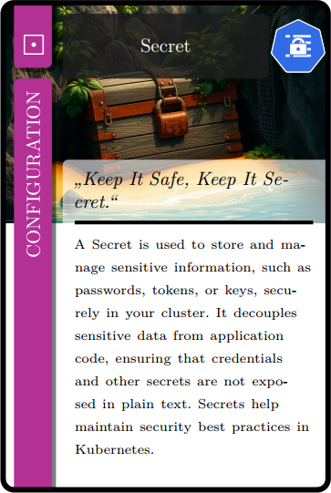
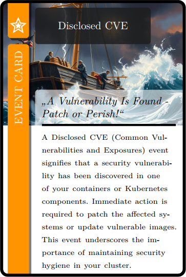

# Kubernetes flash and playing cards
|  |  |  |  |  |
|-----------------------|-----------------------|-----------------------|-----------------------|-----------------------|

This project contains a set of 32 Kubernetes-themed flash and playing cards designed to help you familiarize yourself with the basic Kubernetes resources and their usage. Each card features a key Kubernetes resource, such as Pods, Deployments, Services, and ConfigMaps, along with useful information to reinforce your understanding.  
The cards are paired with a set of game rules, allowing you to learn in a group setting while having fun. Whether you're a beginner or looking to sharpen your Kubernetes knowledge, this card game provides an interactive and engaging way to master Kubernetes concepts.  

The playing cards and rules are offered in different languages.  
| Language | Cards PDF       | Rules PDF       |
|----------|----------------|-----------------|
| English  | [cards-en.pdf](cards-en.pdf) | [rules-en.pdf](rules-en.pdf) |
| German   | [cards-de.pdf](cards-de.pdf) | [rules-de.pdf](rules-de.pdf) |

## Disclaimer
This project was created as a hobby and serves as a showcase/example that helped me to familiarize myself with the latest AI tools and their possibilities. It is not intended to be a comprehensive or exhaustive resource on Kubernetes or card games, and I do not claim completeness.  
Nonetheless, I strive for accuracy and can assure you that each card has been reviewed at least once by a person with a solid understanding of Kubernetes. Sometimes however, due to the space limitations on each card, the description of a resource had to be simplified to its core or main use case. If in doubt, please consult the excellent [Kubernetes documentation](https://kubernetes.io/docs/home/).  

I encourage everyone to extend the rules and cards as they see fit to improve or adapt the project. Pull requests are welcome. Please note that any modifications or contributions should adhere to the project's licensing terms.

## License
The code in this project, including the LaTeX `.tex` files, is licensed under [CC BY-NC-SA 4.0](https://creativecommons.org/licenses/by-nc-sa/4.0/). This includes both the LaTeX formatting code and the content (such as text for the cards, rules, and descriptions).  

The images in the folder `cards/img/ai` are AI-generated, and their rights are not fully clarified at this time. Until these rights are determined, the images are not explicitly licensed. Use of the images is at your own discretion, and you may need to seek permission for commercial use.  

The images in the folder `cards/img/k8s` are from the [Kubernetes Icons Set](https://github.com/kubernetes/community/tree/master/icons) and are licensed under a choice of either Apache-2.0 or CC-BY-4.0 (Creative Commons Attribution 4.0 International).  

## Acknowledgments
A special thanks to **[dexteritas](https://tex.stackexchange.com/users/123129/dexteritas)** for creating the original playing card skeleton and sharing it in a [StackExchange post](https://tex.stackexchange.com/questions/47924/creating-playing-cards-using-tikz).  
The generous permission to use the skeleton for any purpose has made this project possible.  
